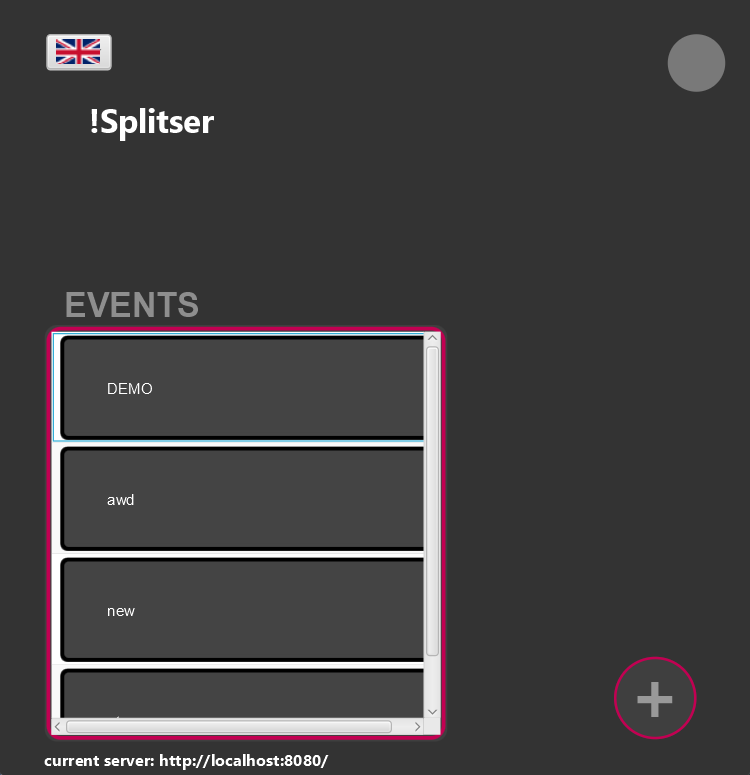

# Object-Oriented Programming Project
This is the group-48 2024 submission for the object-oriented programming project.\
The goal of this project was to create an app which one can use to manage expenses and debts between people.
This includes features such as having "events" in which to contain and organize expenses and payments
shared between participants.

## Server
The server is hosted on port `8080`.
##### Endpoints
All endpoints 
- Are under the path `/api/`
- Follow REST protocol
- Request bodies should be JSON format
- Information returned in JSON format
###### Admin Controller
- `/api/auth/`\
    POST: Request body should contain a string `request` string and returns an HTTP status if this request is authorized.
###### Email Controller
- `/api/email/`
  - `./send`\
    POST: Request body should contain an [EmailRequest](commons/src/main/java/commons/EmailRequest.java) object and returns HTTP status indicating if the email was sent successfully.
###### Event Controller
- `/api/events/`\
    GET: Returns a list containing all events in the database.\
    POST: Request body should contain an [Event](commons/src/main/java/commons/Event.java), adds a new event to the database, status code indicates if event could be added.
  - `./{uuid}`\
    GET: Returns the event with the given UUID, with a status code indicating if the event exists.\
    PUT: Request body should contain the updated event; updates the event with the given UUID, with a status code indicating if the event exists and could be changed.\
    DELETE: Deletes the event with the given UUID, with a status code indicating if the event existed and could be deleted.
    - `./tags`\
      GET: Returns a list of tags that exist for the given event, with a status code indicating if the event exists.\
      POST: Request body should contain a `tag`; adds a tag to an event, with a status code indicating if the event exists and the tag could be added.
    - `./users`\
      POST: Request body should contain a [User](commons/src/main/java/commons/User.java); adds a participant to the event, with a status code indicating if the event exists and the participant could be added.\
      - `./{email}`\
          DELETE: Removes a participant from an event, with a status code indicating if event exists and the participant could be deleted.
    - `./transactions`\
      GET: Returns a list of transactions for a given event, with a status code indicating if event exists.
      - `./{trId}`\
        GET: Returns a transaction defined by the id, with a status code indicating if event and transaction exist.
      - `./<expenses/payments>`\
        POST: Request body should contain an [Event](commons/src/main/java/commons/Event.java); creates a new expense/payment for the given event, with a status code indicating if event exists and expense could be created.
        - `./{id}`\
            DELETE: Deletes specified expense/payment.
  - `/poll`\
    GET: Used to poll events, returns a `DeferredResult` to register if any events are changed. Poll has a timeout of 5000 ms.

###### Tag Controller
- `/api/tags`\
    GET: Returns a list of all tags in the database.\
    POST: Request body should contain a [Tag](commons/src/main/java/commons/transactions/Tag.java); creates a new tag in the database.
  - `./{id}`\
    GET: Returns the tag with the specified id number.\
    PUT: Request body should contain the update tag; updates and returns the specified tag in the database.\
    DELETE: Deletes specified tag from the database.

###### User Controller
- `/api/users`\
    GET: Returns a list of all participants in the database.\
    POST: Request body should contain a [User](commons/src/main/java/commons/User.java); creates a new participant in the database.
  - `./{email}`\
    GET: Returns the participant identified by the specified email.\
    PUT: Request body should contain the updated participant; updates and returns the specified participant.\
    DELETE: Deletes the specified participant from the database.

###### WebSocketEventController
- `/event`\
  MESSAGE: Used for websockets, deletes an event.

## Client
##### Homepage

###### Features
- Language can be selected with the dropdown in the top-left.
- Events from the connected server can be seen in a list
  - *Double*-clicking the event will bring client to the event's [overview](#event-overview) page
- Additional menus can be found by clicking the top-right icon; this can lead to:
  - [Settings](#settings)
  - [Admin Login](#admin-login)
  - [Server Select](#server-select)
  - [Test Mail](#test-mail)
- The bottom-right plus button can be clicked to join, or create a new event
  - Joining will require you to input the invite code
  - Creating will require a new title for the event
- The !Splitser™ server that you are connected to is displayed at the bottom of the page
###### Keyboard Shortcuts
- `ESC`: Will toggle the menu displayed by clicking the top-right icon, unless the new event menu is open, in which case it will simply close the menu.
- `ENTER`: If the new-event menu is opened, will attempt to join the event specified by the invite code.
- `CTRL + N`: If the new-event menu is not yet showing, this will open it; if it is, this will open a menu to create a new event.
- `CTRL + Z`: If editing the title, will undo the edit.

##### Event Overview

###### Features
- *Double*-clicking the title will allow you to edit the event's title
- Language can be changed by the dropdown under the title
- A list of the event's expenses and payments can be seen in the scrollable menu
  - The first 3 tags of an expense will be displayed on its card
  - *Double*-clicking an expense will allow you to edit or remove said expense from the event
  - Payments **cannot** be removed from an event.
- Expenses can be searched for by
  - Their description using by the filter field.
  - Their tags by using the dropdown.
- Clicking the "Invite Code" button will copy the event's invite code to the clipboard.
- Clicking back in the top-left will return you to the homepage
- Clicking the "Participants" button will open a menu displaying all users participating in the event
  - *Double*-clicking a user will open the [manage-participant menu](#manage-participant), allowing you to edit a participant's details.
  - Clicking the "X" next to a user will remove the user from participating in the event if possible
  - Clicking "Add Participant" will allow you to make created users participate in the event.
    - Clicking "New Participant" will open the [manage-participant menu](#manage-participant), allowing you to create a new user.
    - Clicking confirm will make selected users participate in the event
    - Using the `ESC` keyboard shortcut or clicking outside the menu will **not** add the selected users to the event.
- Clicking the "Debts" button will open the [debts overview page](#debts-overview).
- Clicking the "+" button in the bottom right will open the [manage-expense page](#manage-expense), allowing you to create a new expense for the event.

###### Keyboard Shortcuts
- `ESC`: If any menu is opened, this will close said menu, if none are opened, this will return the user to the homepage.
- `ENTER`: If the "Add Participant" menu is open, this will confirm the choices and make the selected users participate in the event.
- `CTRL + C`: Will copy the event's invite code
- `CTRL + N`: Will open the [manage-expense page](#manage-expense) allowing you to create a new expense for the event.
- `CTRL + Z`: If a field is selected, will undo previous edits.

##### Manage Expense

###### Features
Allows you to fill in all information needed for an expense:
- Sponsor: who paid for the expense
- Description: short description of the expense
- Quantity: How much was paid, what currency?
- Date: When the expense took place
- Split method:
  - Equally between everybody: will share the cost of this expense between all participants of the event.
  - Only some people: will share the cost of this expense between the selected participants.
- Expense type:
  - Adds tags to the expense
  - Select tag using the dropdown, then click "Add Tag" to confirm the addition

###### Keyboard Shortcuts
- `ESC`: Returns you to the [event overview page](#event-overview)
- `ENTER`: Submits changes

##### Manage Participant

###### Features
Allows you to fill in all information to manage users.
- All fields must be filled in.
- When editing a user, the email may not be changed
- Email must
  - Follow the format `X+.X*@X+.X+`, where `X` represents a character, `+` means `> 0`, and `*` means `>= 0`.
  - Be unique for that event. 
- If creating a new user, they will not participate in the event by default.

###### Keyboard Shortcuts
- `ESC`: Will cancel changes and return you to the event overview
- `ENTER`: Will submit changes and create a new user
- `CTRL + Z`: If a field is selected, this will undo changes.

##### Debts Overview

###### Features
Provides an overview of each participant's debts, as well as a total sum of all expenses.
- Clicking the "Settle Debts" button will redirect you to the [debts payment page](#debts-payment)

###### Keyboard Shortcuts
- `ESC`: Will return you to the event overview

##### Debts Payment

###### Features
Provides payment instructions for settling debts between the participants of the event.
- Additional info about how to pay participants can be seen by clicking the instruction.
- Clicking the "Settle debts" button will create a record the payment between the participants in the event

###### Keyboard Shortcuts
- `ESC`: Will return you to the debts overview page.

##### Settings

###### Features
General settings that apply across the entire application
- Currency: The currency in which the costs of expenses should be displayed
- Language: The language in which to display the app
  - The "+" button will allow you to download a JSON template to add your own language
- High contrast: changes the colors of the app into high-contrast mode

###### Keyboard Shortcuts
- `ESC`: Will return you to the homepage.

##### Admin Login

###### Features
A page to log in to the admin overview page. This password can be found in the server terminal.\
That's kinda it... 😐

###### Keyboard Shortcuts
- `ESC`: Will return you to the homepage.
- `ENTER`: Will submit the password

##### Admin Overview

###### Features
Allows an admin to see and manage events stored on the database
- Sort buttons
  - Clicking a button again will reverse the order in which it is sorted
- *Double*-clicking an event will provide you with all details of the event
- *Single*-clicking an event will select it for further actions
- The "Export Event" button will allow you to download a JSON representation of the selected event
- The "Import Event" button will ask for a JSON representation of an event to be imported into the database.
- The "Delete Event" button will delete the selected event (after asking for confirmation).

###### Keyboard Shortcuts
- `ESC`: Will return you to the homepage

##### Server Select

###### Features
Allows you to swap !Splitser™ servers.
- IP: can be either "localhost" (`127.0.0.1`) or a valid IPv4 address
- Port: must be a valid port (`0 <= port <= 65535`)
- Connecting has a timeout time of 5000 ms (5s).
- If the server could not be connected to, the server will revert to the previous stable choice.

###### Keyboard Shortcuts
- `ESC`: Will cancel changes and return you to the homepage
- `ENTER`: Will attempt to connect to the specified server
- `CTRL + Z`: If a field is selected, this will undo changes.

##### Test Mail
Will just send a test email to the email registered in the config file.

### Configs
Launch configurations can be found at the path: [client/src/main/resources/config.properties](client/src/main/resources/config.properties).
Any changes made during runtime of the app will also be saved to the configuration file upon closing the application.

###### Currency codes
- `EUR` -> Euro
- `USD` -> United Stated Dollar
- `CHF` -> Swiss Franc
- `GBP` -> Great British Pound 💩
- `JPY` -> Japanese Yen
- `CNY` -> Chinese Yuan
###### Language codes
- `EN` -> English
- `NL` -> Dutch
- `TR` -> Turkish
